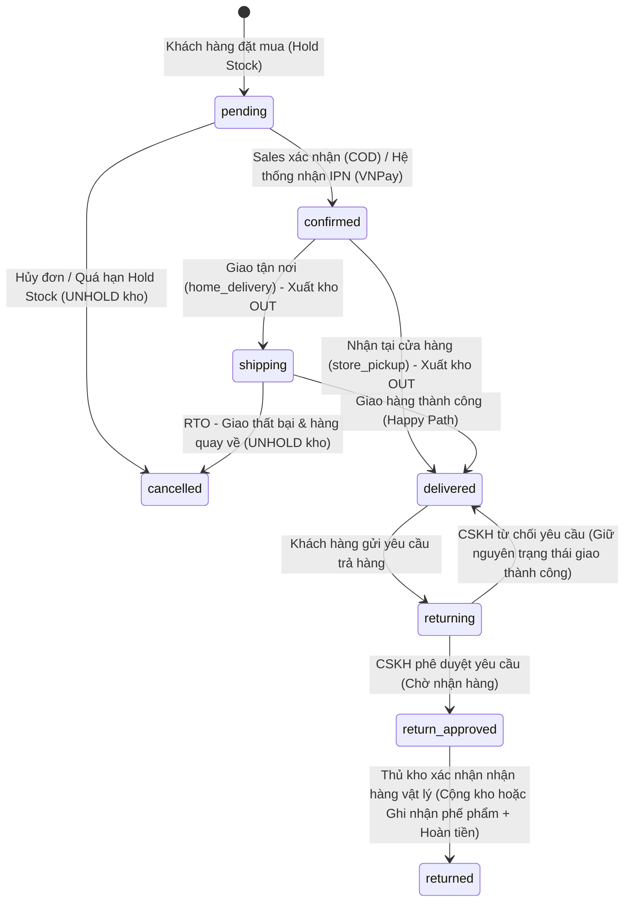

# Quy Trình Nghiệp Vụ Khép Kín Hệ Thống Thời Trang Kvil

Tài liệu này mô tả chi tiết quy trình nghiệp vụ khép kín từ khâu sản xuất, quản lý kho, bán hàng, cho đến xử lý sau bán hàng (trả hàng, hoàn tiền, hàng chuyển hoàn) của thương hiệu thời trang Kvil.

Hệ thống được thiết kế tối ưu hóa sự phối hợp giữa các bộ phận: **Sản xuất (Xưởng)**, **Quản lý kho (Thủ kho)**, **Kinh doanh (Sales)**, **Chăm sóc khách hàng (CSKH)** và **Kế toán**.

---

## Sơ đồ trạng thái đơn hàng (Order State Machine)

Quy trình xử lý đơn hàng trải qua các trạng thái được thể hiện trong sơ đồ dưới đây:

---

## Chi tiết 6 Giai đoạn Vận hành Nghiệp vụ

### Giai đoạn 1: Sản xuất & Nhập kho (Inbound & Inventory)

1. **Khai báo sản phẩm (Sales/Thiết kế)**:
   - Trước khi sản xuất hàng loạt, bộ phận thiết kế/Kinh doanh khai báo thông tin sản phẩm (Tên, Thuộc tính, Màu sắc, Kích cỡ) lên hệ thống để tạo các biến thể và mã SKU tương ứng.
2. **Sản xuất và Gắn mã (Xưởng sản xuất)**:
   - Xưởng hoàn thiện sản phẩm vật lý và gắn tag chứa mã SKU tương ứng đã được khai báo trên hệ thống.
   - Mã SKU được thiết kế theo quy tắc quản lý của Kvil (Ví dụ: `Mã sản phẩm - Size - Màu`).
3. **Nhập kho hệ thống (Thủ kho)**:
   - Thủ kho nhận hàng vật lý từ xưởng sản xuất, đối đếm số lượng thực tế.
   - Trên hệ thống quản trị, thủ kho chọn SKU có sẵn, nhập **Số lượng thực tế** và **Giá vốn (Giá sản xuất - COGS)**.
   - Hệ thống tự động kiểm tra: Nếu SKU tồn tại, hệ thống sẽ cộng dồn số lượng vào kho và tạo bản ghi lịch sử kho `IN` (Lưu vết kèm Timestamp). Giá vốn của từng đợt nhập hàng được lưu trữ để tính toán giá trị tồn kho và lợi nhuận theo phương pháp **Average Cost (Giá vốn bình quân)**.
4. **Đối soát bàn giao**:
   - Quá trình bàn giao giữa Xưởng sản xuất và Kho được đối soát thông qua biên bản bàn giao giấy (chữ ký vật lý) và đối soát định kỳ hàng tuần thông qua tệp Excel xuất từ hệ thống.

---

### Giai đoạn 2: Khách hàng Đặt mua (Order Placement & Hold Stock)

1. **Cơ chế Tạm giữ tồn kho (Hold Stock)**:
   - Khi khách hàng nhấn đặt mua sản phẩm, hệ thống lập tức trừ đi số lượng sản phẩm tương ứng trong kho bán lẻ trực tuyến và ghi log tồn kho dạng `HOLD` (Tạm giữ). Trạng thái đơn hàng chuyển thành `pending`.
   - Cơ chế này giúp ngăn chặn tình trạng bán quá đà (**Overselling**) đối với các sản phẩm đang có số lượng tồn kho thấp.
2. **Giải phóng tồn kho tự động (Hold Stock Timeout)**:
   - Để tránh việc khách hàng tạo đơn ảo hoặc không hoàn thành thanh toán gây "găm hàng" trong kho, hệ thống cấu hình Hold Stock Scheduler chạy định kỳ mỗi 5 phút:
     - **Với đơn thanh toán VNPay**: Nếu trạng thái là `pending` và chưa thanh toán thành công (IPN chưa kích hoạt) quá **15 phút**, hệ thống tự động hủy đơn (`cancelled`), cộng lại tồn kho bán lẻ (UNHOLD) và ghi log kho kèm lý do `[AUTO] Hủy tạm giữ do đơn quá hạn VNPay`.
     - **Với đơn COD**: Nếu đơn hàng ở trạng thái `pending` quá **24 giờ** mà chưa được bộ phận Sales xác nhận, hệ thống tự động hủy đơn (`cancelled`), giải phóng tồn kho (UNHOLD) và ghi log kho kèm lý do `[AUTO] Hủy tạm giữ do đơn quá hạn COD`.

---

### Giai đoạn 3: Xác nhận & Xuất kho (Order Confirmation & Outbound)

1. **Xác nhận đơn hàng**:
   - **Đơn VNPay**: Xác nhận tự động (`confirmed`) ngay sau khi hệ thống nhận được tín hiệu IPN (Instant Payment Notification) từ cổng thanh toán VNPay thông báo giao dịch thành công.
   - **Đơn COD**: Nhân viên Sales gọi điện thoại xác nhận đơn hàng với khách hàng. Sau khi xác nhận thành công, Sales cập nhật trạng thái đơn thành `confirmed` trên trang quản trị.
2. **Xuất kho vật lý (Outbound)**:
   - **Đối với Giao tận nơi (home_delivery)**:
     - Định kỳ hàng ngày, nhân viên Sales xuất danh sách các đơn hàng ở trạng thái `confirmed` sang tệp Excel để nhập vào cổng thông tin của Đơn vị vận chuyển (Giao Hàng Tiết Kiệm - GHTK).
     - Hệ thống vận hành theo quy trình **thủ công qua file Excel** để tối ưu hóa chi phí vận hành (không tốn chi phí tích hợp API trực tiếp của ĐVVC).
     - Thủ kho dựa trên danh sách đơn để tiến hành nhặt hàng, đóng gói và dán mã vận đơn của GHTK lên kiện hàng. Hệ thống chuyển trạng thái đơn sang `shipping` và ghi log xuất kho `OUT` kèm thông tin đơn hàng tương ứng (Bàn giao cho ĐVVC).
   - **Đối với Nhận tại cửa hàng (store_pickup)**:
     - Đơn hàng sau khi được xác nhận (`confirmed`) sẽ được lưu giữ tại cửa hàng (không xuất kho `OUT` và không đi qua trạng thái `shipping`).
     - Khi khách hàng đến cửa hàng nhận sản phẩm, nhân viên thực hiện cập nhật trạng thái trực tiếp từ `confirmed` sang `delivered` (Đã giao) trên trang quản trị. Tại thời điểm này, hệ thống mới chính thức ghi log xuất kho `OUT` trực tiếp với ghi chú: `Xuất kho trực tiếp (Khách nhận tại cửa hàng) cho đơn hàng #...`.

---

### Giai đoạn 4: Giao hàng & Xử lý sau bán (Delivery, Returns & RTO)

Sau khi bàn giao cho Đơn vị vận chuyển (ĐVVC), quy trình chia thành 3 kịch bản thực tế:

#### Kịch bản 1: Giao hàng thành công (Happy Path)

- ĐVVC giao hàng thành công đến khách hàng.
- Trạng thái đơn hàng trên hệ thống được cập nhật thành `delivered` (Hoàn thành).

#### Kịch bản 2: Trả hàng & Hoàn tiền 2 bước (Return & Refund)

Quy trình trả hàng bắt buộc phải đi qua 2 bước kiểm duyệt chặt chẽ để chống thất thoát hàng hóa và tài chính:

- **Bước 1: CSKH tiếp nhận và phê duyệt yêu cầu (Phê duyệt lý thuyết)**
  - Khách hàng gửi yêu cầu trả hàng từ trang lịch sử mua hàng, chọn lý do và tải lên hình ảnh minh chứng lỗi sản phẩm.
  - **Đối với đơn hàng COD**: Khách hàng bắt buộc phải cung cấp thông tin tài khoản ngân hàng nhận tiền hoàn (Tên ngân hàng, Số tài khoản, Tên chủ tài khoản). Hệ thống sẽ nhúng thông tin này vào chuỗi lý do gửi lên hệ thống dạng: `[Thông tin hoàn tiền: Ngân hàng - STK - TÊN CHỦ TK] - Lý do: ...`.
  - Nhân viên CSKH kiểm tra hình ảnh minh chứng và lý do. Nếu hợp lý, CSKH nhấn **Phê duyệt**.
  - Lúc này, trạng thái đơn hàng chuyển sang `return_approved` (Chờ nhận hàng hoàn). **Quy trình tuyệt đối KHÔNG cộng lại tồn kho bán lẻ trực tuyến và KHÔNG kích hoạt lệnh hoàn tiền ở bước này** nhằm tránh trường hợp khách hàng không gửi hàng về hoặc gửi hàng giả, hàng kém chất lượng.
- **Bước 2: Thủ kho xác nhận nhận hàng hoàn vật lý (Phê duyệt thực tế)**
  - Gói hàng hoàn từ khách hàng được vận chuyển về kho của Kvil.
  - Thủ kho mở hộp kiểm tra tình trạng hàng vật lý thực tế và thao tác trên trang quản trị:
    - **Nếu hàng nguyên vẹn (đủ tem mác, chưa qua sử dụng)**: Thủ kho chọn tình trạng hàng **"Nguyên vẹn"**. Hệ thống tự động chuyển trạng thái đơn sang `returned`, **cộng lại số lượng sản phẩm vào kho bán lẻ trực tuyến** và ghi nhận log kho `RETURN` để đưa sản phẩm trở lại vòng đời bán hàng.
    - **Nếu hàng bị lỗi/hỏng (rách, bẩn, mất form do lỗi của khách hoặc ĐVVC)**: Thủ kho chọn tình trạng hàng **"Lỗi/Hỏng"**. Hệ thống chuyển đơn sang `returned` nhưng **KHÔNG cộng lại vào kho bán lẻ**, đồng thời ghi log kho phế phẩm `RETURN_DEFECTIVE` (để theo dõi hao hụt và xử lý thanh lý sau).
- **Thực hiện Hoàn tiền (Refund Action)**:
  - Sau khi thủ kho hoàn tất xác nhận nhận hàng ở Bước 2, cơ chế hoàn tiền được kích hoạt:
    - **Đơn hàng VNPay**: Hệ thống tự động tính toán số tiền hoàn dựa trên chính sách **Partial Refund (Hoàn tiền một phần)**: `Tiền hoàn = Tổng số tiền khách trả - 15.000đ` (Khách hàng chịu phí ship chiều về cố định là 15.000đ). Hệ thống tự động gửi yêu cầu API hoàn tiền sang cổng VNPay và ghi nhận log giao dịch.
    - **Đơn hàng COD**: Hệ thống tự động tạo một bản ghi giao dịch `COD_REFUND` ở trạng thái `PENDING` với số tiền âm (ví dụ: `-250.000đ`) thể hiện dòng tiền chi ra. Kế toán đọc thông tin tài khoản ngân hàng của khách (được hiển thị trực quan trong trang chi tiết yêu cầu trả hàng bằng cách tự động tách từ chuỗi lý do) để thực hiện chuyển khoản thủ công qua Internet Banking, sau đó nhấn xác nhận đã chuyển khoản để hoàn tất giao dịch trên hệ thống.

#### Kịch bản 3: Giao hàng thất bại và Chuyển hoàn (Return to Sender - RTO)

- ĐVVC giao hàng không thành công sau 3 lần thử (khách không nghe máy, từ chối nhận). Kiện hàng được chuyển hoàn về kho Kvil.
- Thủ kho nhận lại kiện hàng RTO vật lý, kiểm tra tính nguyên vẹn của niêm phong.
- Trên trang quản trị, thủ kho/sales cập nhật trạng thái đơn hàng sang `cancelled`, hệ thống tự động cộng lại số lượng sản phẩm vào kho bán lẻ trực tuyến (UNHOLD) và tạo log kho giải phóng hàng chuyển hoàn.

---

### Giai đoạn 5: Thống kê & Báo cáo (Analytics & Reporting)

- **Tính toán Giá vốn (COGS)**: Hệ thống sử dụng phương pháp **Bình quân gia quyền (Weighted Average Cost - AVG)** để tự động tính toán giá vốn của các sản phẩm bán ra. Mỗi lần nhập kho (lô mới), hệ thống sẽ cập nhật giá vốn bình quân gia quyền của biến thể đó. Khi có đơn hàng hoàn tất (`delivered`), giá vốn trung bình tại thời điểm đó (avgCostPrice snapshot) được ghi nhận vào `OrderItems.costPrice` để tính toán chính xác giá vốn hàng bán (COGS) và lợi nhuận gộp.
- **Báo cáo Lãi/Lỗ**: Dựa trên doanh thu thuần (đã trừ các khoản hoàn trả khách hàng) và COGS tương ứng, hệ thống xuất báo cáo doanh thu, lợi nhuận gộp và tỉ suất lợi nhuận trực quan trên Dashboard quản trị.
- _Tham chiếu tài liệu kỹ thuật chi tiết tại: `kvil-fifo-costing.md` (tài liệu thực tế mô tả phương pháp Bình quân gia quyền) và `kvil-dashboard-report.md`._

---

### Giai đoạn 6: Chiến lược & Cảnh báo tồn kho (Inventory Strategy)

- **Cảnh báo tồn kho**: Hệ thống cung cấp các báo cáo tồn kho chuyên sâu:
  - **Sắp hết hàng (Low Stock)**: Danh sách SKU có số lượng dưới ngưỡng tối thiểu để chuẩn bị kế hoạch sản xuất thêm.
  - **Tồn kho chậm (Slow Products)**: Danh sách các sản phẩm có tốc độ bán hàng thấp để phòng kinh doanh lên chiến dịch khuyến mãi, xả hàng.
- **Quy trình xử lý chiến lược**: Việc đưa ra quyết định sản xuất thêm hoặc chạy khuyến mãi hiện tại được thực hiện thủ công bởi ban quản trị dựa trên số liệu báo cáo, đảm bảo tính linh hoạt trong chiến lược kinh doanh của doanh nghiệp.
